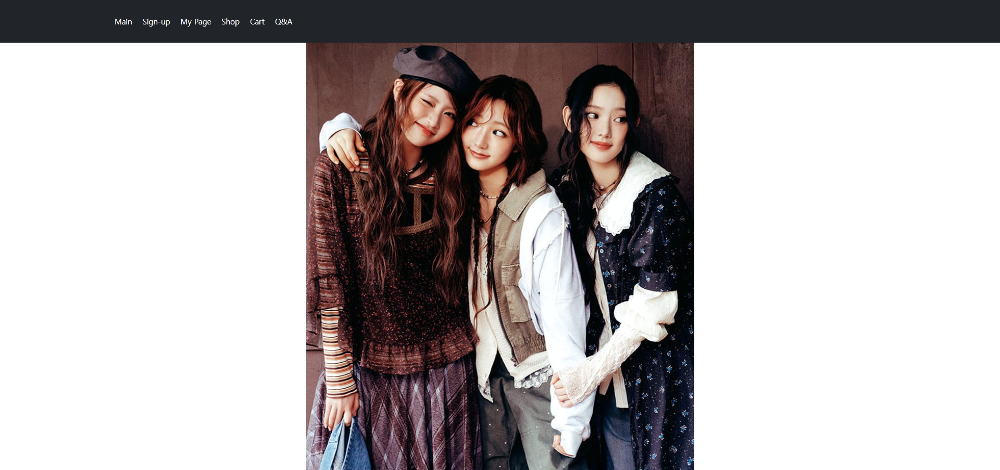
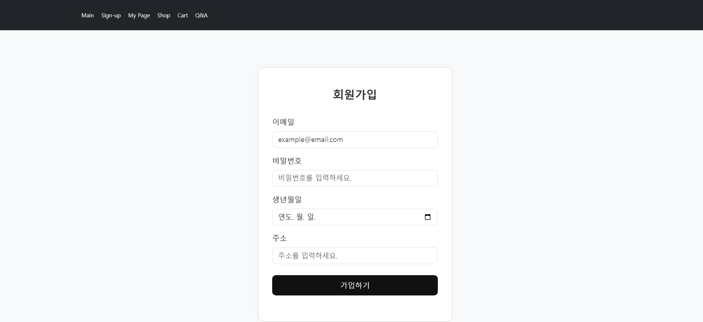
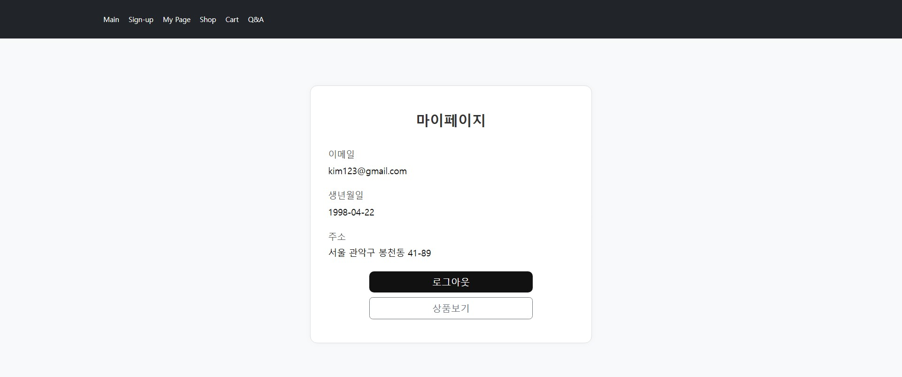
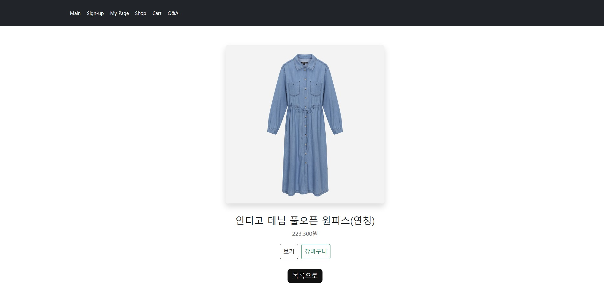
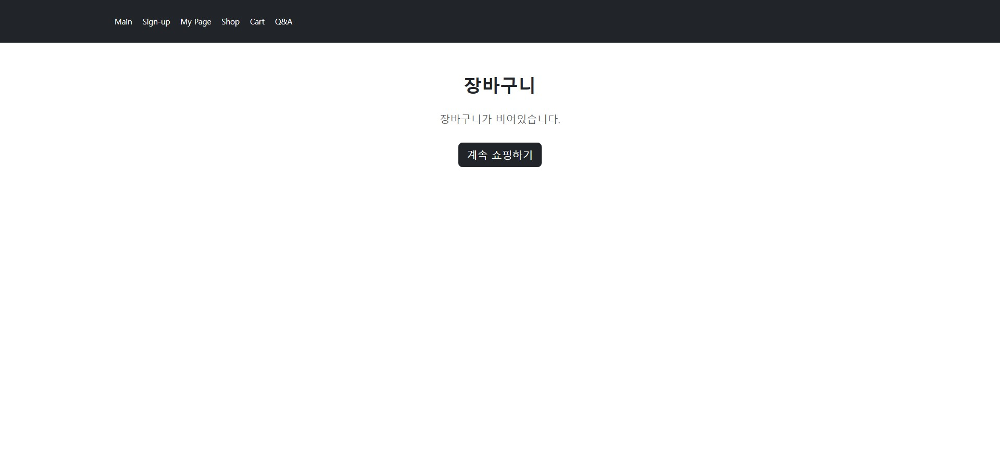
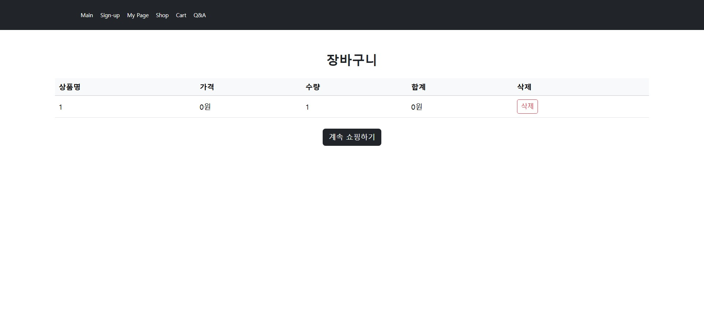
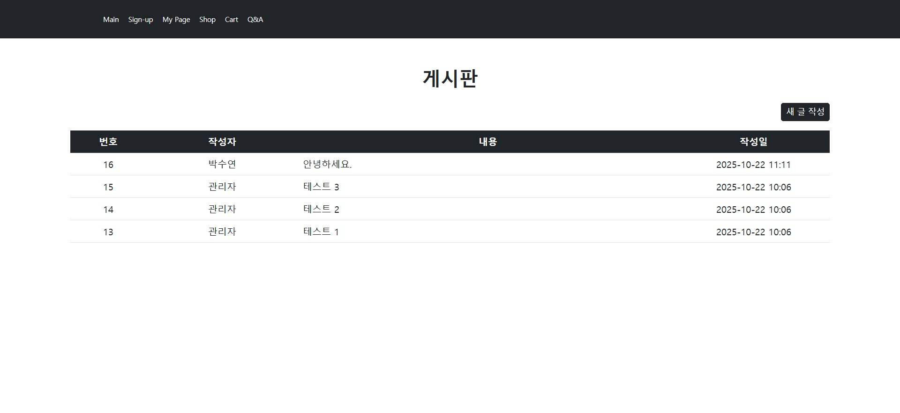
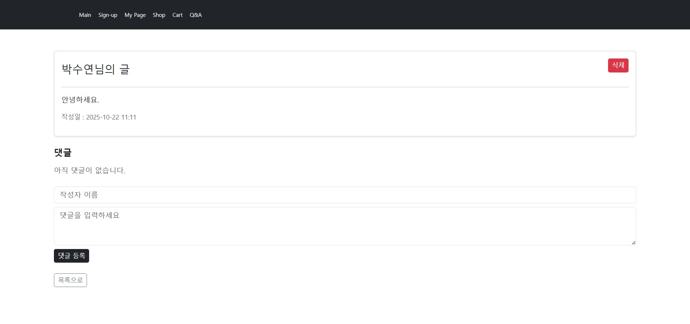

# Shop Project

Spring MVC 기반으로 제작한 쇼핑몰 예제 프로젝트입니다.  
처음으로 STS(Spring Tool Suite)와 DBeaver를 활용하여 데이터베이스 연동을 경험하며,  
회원 관리와 상품 관리, Q&A 게시판까지 웹 서비스의 기본 기능들을 구현했습니다.  

## 프로젝트 개요
- **개발 환경**: STS(Spring Tool Suite), Maven
- **DB 관리 툴**: DBeaver
- **DBMS**: MySQL
- **언어**: Java, JSP
- **버전 관리**: Git/GitHub/Sourcetree

## 주요 기능
- **메인(Main)**: 기본 화면 구성
- **회원가입(Sign-up) / 로그인 / 로그아웃**
- **마이페이지(My Page)**: 회원 정보 확인 및 관리
- **상품 페이지(Shop)**: 상품 목록 및 상세보기
- **장바구니 페이지(Cart)** : 로그인 후 상품 담기
- **Q&A 게시판**: 게시글 작성/수정/삭제 + 댓글 기능 구현

## 실행 화면
메인 페이지  

회원가입 페이지  

상품 페이지 (1)  

상품 페이지 (2)

장바구니 페이지 (1)

장바구니 페이지 (2)

Q&A 게시판  (1)

Q&A 게시판  (2)

## 💡 배운 점
- MVC 패턴을 적용해 **뷰와 로직을 분리**하는 방법 학습
- MySQL + DBeaver를 활용해 **DB 연동 및 CRUD 처리** 경험
- Q&A 게시판 댓글 구현을 통해 **관계형 데이터 설계와 처리 로직** 이해
- **GPT를 활용해 에러 문제 해결**을 검토 
- GitHub에 프로젝트를 업로드하며 **버전 관리와 프로젝트 공유 경험** 습득
